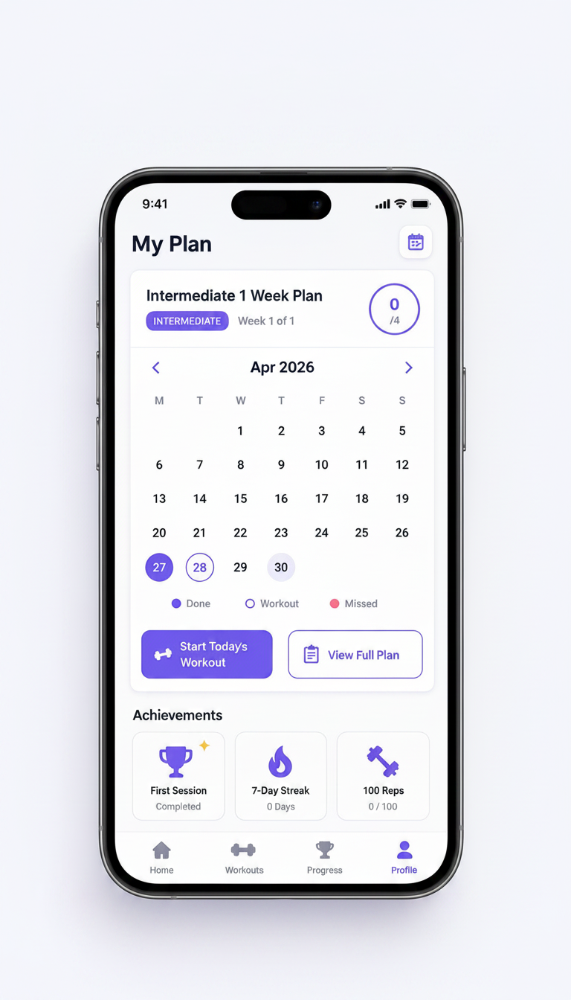

<p align="center">
  
</p>

<h1 align="center">FitCounter</h1>

<p align="center">
  Your phone distractions become your workout.
</p>

---

## What is FitCounter?

FitCounter is an Android fitness app that connects two problems most people face separately — **phone addiction** and **skipping exercise**.

Start a Focus Session, pick apps to avoid (YouTube, Instagram, TikTok), and set a timer. If you open one of those apps, you earn **exercise debt** — a set of push-ups, sit-ups, or squats that must be completed using the phone camera before the debt clears.

The camera counts your reps in real time and scores your form. You cannot fake it.

---

## Screenshots

<table align="center">
  <tr>
    <td align="center" width="220"></td>
    <td width="16"></td>
    <td align="center" width="220"></td>
    <td width="16"></td>
    <td align="center" width="220"></td>
    <td width="16"></td>
    <td align="center" width="220"></td>
  </tr>
  <tr>
    <td align="center"><sub><b>Live Rep Counting</b></sub></td>
    <td></td>
    <td align="center"><sub><b>Home Screen</b></sub></td>
    <td></td>
    <td align="center"><sub><b>Workout Plan</b></sub></td>
    <td></td>
    <td align="center"><sub><b>AI Coach</b></sub></td>
  </tr>
</table>

---

## Core Features

| Feature | Description |
|---|---|
| **Real-time rep counting** | Camera-based pose detection counts push-ups, sit-ups, and squats at 30 fps |
| **Rep scoring** | Every rep scored 0–100 across depth, form, stability, and tempo |
| **Focus sessions** | Block distracting apps during a timed session |
| **Exercise debt** | Opening a blocked app adds penalty sets — paid back through camera-verified reps |
| **AI Coach** | Chat interface for personalised workout plans powered by Groq |
| **Workout plans** | Instructor-designed plans or AI-generated custom plans |
| **Google Calendar sync** | Workout schedule pushed directly to your calendar |
| **XP & Leaderboard** | Earn XP per session, compete on a global Firebase leaderboard |

---

## Supported Exercises

<p align="center">
  
  &nbsp;&nbsp;
  
  &nbsp;&nbsp;
  
</p>

<p align="center"><b>Push-ups &nbsp;&nbsp;|&nbsp;&nbsp; Sit-ups &nbsp;&nbsp;|&nbsp;&nbsp; Squats</b></p>

---

## System Architecture

<p align="center">
  
</p>

The app is structured in four layers:

1. **React Native UI** — screens, overlays, and navigation
2. **Zustand State Stores** — exercise, focus, auth, calendar persisted via AsyncStorage
3. **TypeScript Core Logic** — pure modules for angle calculation, smoothing, state machine, and scoring
4. **Native Android (Kotlin)** — ML Kit pose detection plugin, AccessibilityService for app monitoring

The JS/native boundary is crossed via `runOnJS()` from VisionCamera worklets, keeping the camera thread unblocked.

---

## How Rep Counting Works

Each camera frame passes through a five-stage pipeline:

```
Camera Frame (native thread)
     ↓
Google ML Kit — 33 body landmarks at ~30 fps
     ↓
Joint Angle Calculation — dot product formula on 3 landmarks
     ↓
Signal Smoothing — spike rejection (>35°/frame) + EMA filter (α=0.4)
     ↓
State Machine — IDLE → DOWN → UP → rep counted (3-frame debounce)
     ↓
Scoring — depth×0.4 + form×0.3 + stability×0.2 + tempo×0.1
```

Reps scoring below 40 are not counted. This is the anti-cheat layer.

### Why Google ML Kit over alternatives

| Option | Reason not used |
|---|---|
| MediaPipe | Ships with skeleton rendering pipeline overhead we don't need — we only use landmark coordinates to calculate angles |
| OpenPose | Requires GPU; too slow for real-time mobile |
| TensorFlow Lite | Requires training your own model |
| PoseNet | Only 17 landmarks; deprecated |
| Accelerometer | Trivial to cheat; cannot detect form |

ML Kit runs entirely on-device with no API key, returns clean landmark coordinates via STREAM\_MODE at 30 fps, and integrates directly into VisionCamera's native frame processor.

---

## Tech Stack

| Layer | Technology |
|---|---|
| App framework | React Native CLI `0.74` |
| Language | TypeScript |
| Camera + frame processing | `react-native-vision-camera` v4 + `react-native-worklets-core` |
| Pose detection | Google ML Kit Accurate Pose (Kotlin native plugin) |
| State management | Zustand |
| Navigation | React Navigation native stack |
| Auth + database | Firebase Auth + Firestore |
| AI backend | Node.js + Groq API |
| App monitoring | Android AccessibilityService |

> **Why React Native CLI over Expo:** Expo has no frame processor API. VisionCamera's frame processors run ML Kit on a dedicated native thread at 30 fps — essential for real-time rep detection. Expo would require ejecting anyway.

---

## Project Structure

```
SystemProject/
├── android/                  # Native Android project + Kotlin modules
│   └── app/src/main/java/    # PoseDetectorPlugin, AppMonitor, AccessibilityService
├── src/
│   ├── components/           # CameraView, ExerciseOverlay, FeedbackBanner, SetSummary
│   ├── core/                 # angles.ts, smoothing.ts, stateMachine.ts, scoring.ts
│   │   └── exercises/        # pushup.ts, situp.ts, squat.ts, angleDetector.ts
│   ├── hooks/                # usePoseDetection, useExerciseTracker
│   ├── screens/              # All app screens
│   ├── store/                # Zustand stores (exercise, focus, auth, xp, calendar)
│   ├── theme/                # Design tokens and colors
│   └── utils/                # Constants (angle thresholds, score weights)
├── backend/                  # Node.js AI chat backend
└── ImagesForGithub/          # README assets
```

---

## Getting Started

### Prerequisites

- Node.js 18+
- JDK 17
- Android Studio with Android SDK and platform tools
- A physical Android device or emulator with camera support

### Installation

```bash
# Clone the repo
git clone <repo-url>
cd SystemProject

# Install dependencies
npm install

# Copy keys file and fill in your Firebase + Google credentials
cp src/config/keys.example.ts src/config/keys.ts

# Run on Android
npx react-native run-android
```

### Backend (AI Chat)

```bash
cd backend
cp .env.example .env   # add your Groq API key
npm install
node index.js
```

### Permissions required on device

- **Camera** — for pose detection
- **Usage Access** — for focus mode app monitoring (grant manually in Android settings)

---

## Running Tests

```bash
# From SystemProject/
npm test

# From backend/
cd backend && npm test
```

## Getting Started

Install dependencies:

```bash
npm install
```

Start Metro:

```bash
npm run start
```

Run on Android:

```bash
npm run android
```

## Available Scripts

| Command | Purpose |
| --- | --- |
| `npm run start` | Start the Metro bundler |
| `npm run android` | Build and launch the Android app |
| `npm run test` | Run the Jest test suite |
| `npm run lint` | Run ESLint across TypeScript source files |

## Supported Exercises

FitCounter currently supports three exercise types:

- Push-ups: tracks elbow extension and body-line form.
- Sit-ups: tracks hip angle and knee-position consistency.
- Squats: tracks lower-body movement using the exercise logic in `src/core/exercises`.

Each exercise has a dedicated rule module so thresholds, ideal ranges, and form feedback can be adjusted without rewriting the camera or UI layers.

## Permissions

The app requests these Android permissions:

- `CAMERA` for live pose tracking.
- `PACKAGE_USAGE_STATS` for blocked-app violation detection.
- `FOREGROUND_SERVICE` and `FOREGROUND_SERVICE_SPECIAL_USE` for the monitoring service.
- `POST_NOTIFICATIONS` for Android notification support.
- `INTERNET` for standard React Native development and runtime networking.

On Android, usage access is a protected permission and must be enabled manually in system settings for app-monitoring behavior to work.

## Development Notes

- Keep movement algorithms inside `src/core` whenever possible.
- Keep UI-specific code inside `src/components` and `src/screens`.
- Use Zustand stores for cross-screen exercise and focus-session state.
- Prefer pure functions for scoring, angle calculation, smoothing, and rep detection.
- Native pose detection code lives under the Android project folder.

## Troubleshooting

If the camera does not open, confirm that device camera permission is granted and that the app is running on a real device or an emulator with camera support.

If app blocking does not trigger on Android, enable usage access for FitCounter from system settings and restart the focus session.

If native builds fail after dependency changes, clean the platform build output and reinstall dependencies:

```bash
npm install
```

For Android, you can also clean Gradle from the `android` directory:

```bash
./gradlew clean
```

## Documentation

For a deeper explanation of the movement pipeline, scoring model, and system design decisions, see `ARCHITECTURE.md`.

For Android Firebase authentication setup, see `AUTH_SETUP_ANDROID.md`.
